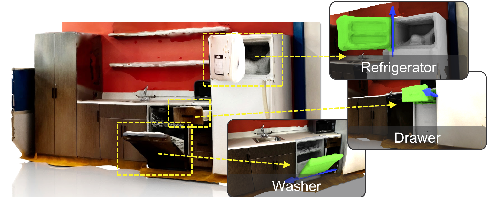

# Ditto in the House: Building Articulation Models of Indoor Scenes through Interactive Perception


[Cheng-Chun Hsu](https://chengchunhsu.github.io/), [Zhenyu Jiang](http://zhenyujiang.me), [Yuke Zhu](https://www.cs.utexas.edu/~yukez/)

ICRA 2023

[Project](https://ut-austin-rpl.github.io/HouseDitto/) | [arxiv](https://arxiv.org/abs/2302.01295)



## Introduction
Our approach, named *Ditto in the House*, discovers possible articulated objects through affordance prediction, interacts with these objects to produce articulated motions, and infers the articulation properties from the visual observations before and after each interaction. The approach consists of two stages — affordance prediction and articulation inference. During affordance prediction, we pass the static scene point cloud into the affordance network and predict the scene-level affordance map. Then, the robot interacts with the object based on those contact points. During articulation inference, we feed the point cloud observations before and after each interaction into the articulation model network to obtain articulation estimation. By aggregating the estimated articulation models, we build the articulation models of the entire scene.


If you find our work useful in your research, please consider [citing](#citing).

## Installation
The codebase consists of three modules:

- `DITH-igibson`: interaction and observation collection in iGibson simulator
- `DITH-pointnet`: affordance prediction
- `DITH-ditto`: articulation inference

Create conda environments and install required packages by running

```bash
cd DITH-igibson
conda env create -f conda_env.yaml -n DITH-igibson

cd ../DITH-pointnet
conda env create -f conda_env.yaml -n DITH-pointnet

cd ../DITH-ditto
conda env create -f conda_env.yaml -n DITH-ditto
```

Build Ditto's dependents by running

```bash
cd DITH-ditto && conda activate DITH-ditto
python scripts/convonet_setup.py build_ext --inplace
```

## Data Collection

1. Run `cd DITH-igibson && conda activate DITH-igibson`
2. Follow [these instructions](https://github.com/StanfordVL/iGibson/tree/master/igibson/utils/data_utils/ext_scene) to import CubiCasa5k scenes into iGibon simulator.
3. Generate training and testing data by running

```bash
python room_dataset_generate.py
python room_dataset_split.py
python room_dataset_preprocess.py
```

The generated data can be found under `dataset/cubicasa5k_rooms_processed`.

## Affordance Prediction

1. Run `cd DITH-pointnet && conda activate DITH-pointnet`
2. Set the `datadir` in `configs/train_pointnet2.yaml` and `configs/test_pointnet2.yaml`.

3. Train the model

```bash
python train.py
```

4. Set the `ckpt_path` in `configs/test_pointnet2.yaml`

5. Test the model

```bash
python test.py
```

## Interaction

1. Run `cd DITH-igibson && conda activate DITH-igibson`
2. Interact with the scene and save the results

```bash
python affordance_prediction_generate.py
```

3. Collect novel scene observations

```bash
# generate articulation observation for training
python object_dataset_generate_train_set.py
# for testing
python object_dataset_generate_test_set.py
```

4. Preprocess for further training

```bash
python object_dataset_preprocess.py
```

The generated data can be found under `dataset/cubicasa5k_objects_processed`.

## Articulation Inference

1. Run `cd DITH-ditto && conda activate DITH-ditto`

2. Train the model

```bash
python run.py experiment=Ditto
```

3. Test the model

```bash
python run_test.py experiment=Ditto_test
```

## Related Repositories

1. The codebase is based on the amazing [Lightning-Hydra-Template](https://github.com/ashleve/lightning-hydra-template).

2. We use [Ditto](https://github.com/UT-Austin-RPL/Ditto) and [PointNet++](https://github.com/erikwijmans/Pointnet2_PyTorch/tree/master) as our backbone.

## Citing

```
@inproceedings{Hsu2023DittoITH,
  title={Ditto in the House: Building Articulation Models of Indoor Scenes through Interactive Perception},
  author={Cheng-Chun Hsu and Zhenyu Jiang and Yuke Zhu},
  booktitle={IEEE International Conference on Robotics and Automation (ICRA)},
  year={2023}
}
```